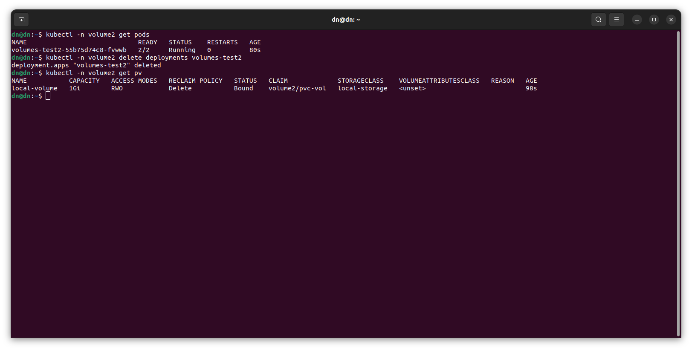
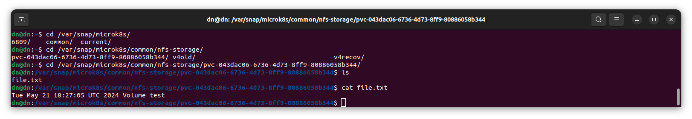

# Никоноров Денис - FOPS-8
# Домашнее задание к занятию «Хранение в K8s. Часть 2»

### Задание 1

**Что нужно сделать**

Создать Deployment приложения, использующего локальный PV, созданный вручную.

1. Создать Deployment приложения, состоящего из контейнеров busybox и multitool.
2. Создать PV и PVC для подключения папки на локальной ноде, которая будет использована в поде.
3. Продемонстрировать, что multitool может читать файл, в который busybox пишет каждые пять секунд в общей директории. 
4. Удалить Deployment и PVC. Продемонстрировать, что после этого произошло с PV. Пояснить, почему.
5. Продемонстрировать, что файл сохранился на локальном диске ноды. Удалить PV.  Продемонстрировать что произошло с файлом после удаления PV. Пояснить, почему.
5. Предоставить манифесты, а также скриншоты или вывод необходимых команд.

------

### Задание 2

**Что нужно сделать**

Создать Deployment приложения, которое может хранить файлы на NFS с динамическим созданием PV.

1. Включить и настроить NFS-сервер на MicroK8S.
2. Создать Deployment приложения состоящего из multitool, и подключить к нему PV, созданный автоматически на сервере NFS.
3. Продемонстрировать возможность чтения и записи файла изнутри пода. 
4. Предоставить манифесты, а также скриншоты или вывод необходимых команд.

------

### Решение задания 1

Создние нового namespace

Написан манифест [deployment](/deployment.yml), использующий локальный PV, созданный руками.

Применен и проверка статуса

Видно статус pending. Глянем describe в этом поде

Под не смог запуститься тк отсутствует PVC `pvc-vol`.

Написан манифест [pv](/pv.yml) и [pvc](/pvc.yml) для подключения папки на локальной ноде, которая будет подключена в поде.

Применены манифесты.

По статусам видно что запустились.

Так теперь нужно проверить статус пода.

и под в статусе running.

Теперь проверим подключимся к multitool сможет ли прочитать файл, в который busybox записывает данные каждые 5 сек.

Также можно посмотреть логи самого контейнера в поде.

Удалим deployment и PVC.

Тутже chek'аем что произошло с PV.

PV перешел в состояние Failed тк контроллер PV не смог удалить данные.

Если PVC не удалять, а удалить только Deployment, то PV будет в статусе Bound.

Проверяем сохранился ли файл на локальном диске ноды.

Видим что файл есть.

Удалим PV.

После удаления PV, файл в директории `/data/pvc-first` останется на месте из-за особенностей работы контроллера PV с hostPath. В случае если манифест PV политика persistentVolumeReclaimPolicy будет установлена в Recycle, то файл будет удален.

### Решение задания 2

Установлен и настроен NFS-сервер на ноде Microk8s.

Напишем манифест [deployment_nfs](/deployment_nfs.yml) c multitool и применим.

В манифесте указано использование NFS сервера, но не создан PVC, под будет находится в режиме ожидания.

PV создался автоматом.

Написан манифест [pvc_nfs](/pvc_nfs.yml) применяю и смотрю состояние.

Видно что запущен.

Проверяем возможность чтения и записи файла изнутри пода.

Также describe pv проверен где смонтировался NFS директория.

Перейдя в дректорию видно созданный из контейнера пода файл.

NFS работает и из пода файл доступен для чтения и записи.